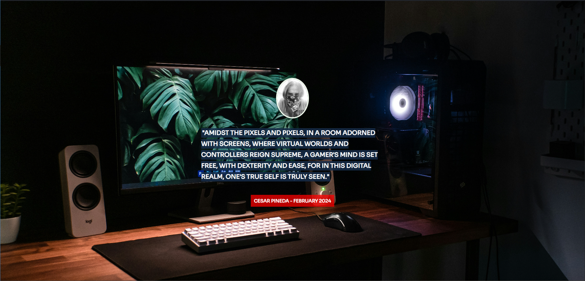

# Poetic Phrase Generator
The Poetic Phrase Generator, powered by the GPT-3.5-Turbo-Instruct model via the Scrimba API in collaboration with OpenAI, revolutionizes creative expression. Seamlessly blending poetic phrases with captivating images tailored to your preferences, it delivers insightful, witty, and sometimes satirical lines inspired by Oscar Wilde's style. Leveraging the GPT-3.5-Turbo-Instruct model's capabilities, it crafts profound phrases while integrating visuals from Unsplash to match each quote's mood. Simply input your name, favorite activity, and beloved place to witness the magic unfold—a unique poetic masterpiece personalized to your taste and ready to inspire.
## 📸 Screenshots

## ⚡ Getting Started!
To run the Poetic Phrase Generator locally on your machine, follow these steps:

- Clone this repository to your local machine using Git.
- Open the index.html file in your web browser.
- Customize the name, favoriteActivity, favoritePlace, and temperature variables in the index.js file to personalize your poetic phrases.

## 🎒 Technologies Used
- HTML
- CSS (with Normalize.css)
- JavaScript (ES6)
- OpenAI GPT-3 API
- Unsplash API
- Google Fonts
  
## Credits
Scrimba for providing the course and API.

## ✨ Features
- Personalized poetic phrases generated in the style of Oscar Wilde.
- Beautiful images fetched from Unsplash to complement the generated quotes.
- Dynamic background based on the chosen place.
- Easy customization of name, favorite activity, and favorite place.

## Usage
Open the Poetic Phrase Generator in your web browser.
Enter your name, favorite activity, and favorite place.
Adjust the temperature slider to control the creativity of the generated phrases.
Click the "Generate" button to see the poetic phrase and image.
Enjoy the delightful combinations of poetic phrases and images!

## License
This project is licensed under the MIT License.
